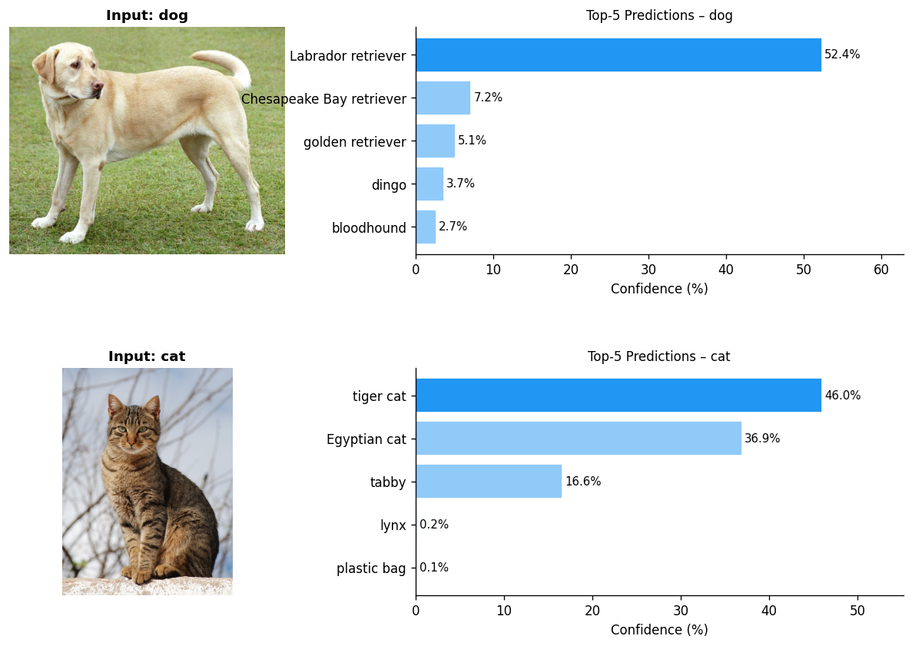
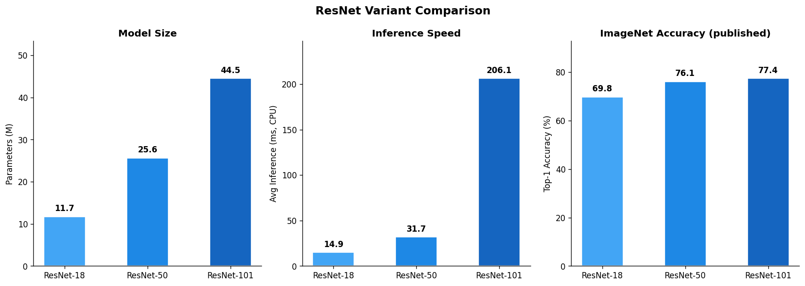
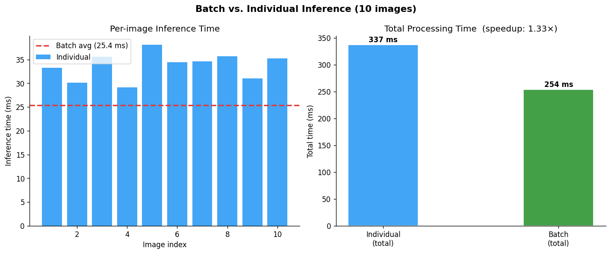

# Image Classification with Pretrained ResNets

A small CLI toolkit around torchvision's pretrained ImageNet models: classify images, compare ResNet-18/50/101 on size vs. speed vs. accuracy, and measure the batching speedup on CPU.

Started as a deep learning lab assignment; restructured here into a proper package (`imgclassify/`) with a CLI, cached labels, and support for classifying your own images instead of only the five bundled samples.

## Install

```bash
pip install -r requirements.txt
```

## Usage

```bash
# Classify the bundled sample images (dog, cat, car, airplane, banana)
python -m imgclassify classify

# Classify your own image
python -m imgclassify classify --image path/to/photo.jpg --top-k 3

# Just a subset of the built-in samples
python -m imgclassify classify --sample cat dog

# Compare ResNet variants on parameter count, CPU inference time, and published accuracy
python -m imgclassify compare

# Batch vs. one-at-a-time inference timing
python -m imgclassify benchmark --n 10

# Everything at once (reproduces the original lab end to end)
python -m imgclassify all
```

Every command prints results to stdout, saves a figure to `results/`, and (unless disabled) writes the raw numbers to `results/*.json`.

## Results

Model: ResNet-50, ImageNet-1k weights. Full run in `results/all_results.json`.

**Top-5 predictions:**



**ResNet-18 vs. ResNet-50 vs. ResNet-101:**

| Model | Params (M) | Avg inference (ms, CPU) | ImageNet top-1 (published) |
|---|---|---|---|
| ResNet-18 | 11.7 | 14.9 | 69.8% |
| ResNet-50 | 25.6 | 31.7 | 76.1% |
| ResNet-101 | 44.5 | 206.1 | 77.4% |



ResNet-101 has only ~1.3 points more accuracy than ResNet-50 here but takes 6.5× longer per image on CPU — for a latency-sensitive deployment, ResNet-50 is the better trade-off.

**Batching speedup** (10 images, ResNet-50, CPU): individual inference totals 337 ms; a single batched forward pass totals 254 ms — a **1.33×** speedup from avoiding 9 redundant model-launch overheads.



## Project structure

```
imgclassify/
├── labels.py      ImageNet class names, cached to .cache/ after first download
├── data.py        sample image set (2 bundled, 3 fetched on first use)
├── predict.py      model loading + single-image top-k inference
├── compare.py      ResNet-18/50/101 comparison
├── benchmark.py     batch vs. individual timing
├── visualize.py     all plotting, saves to results/
└── cli.py           `python -m imgclassify <classify|compare|benchmark|all>`
data/images/          bundled sample images (dog.jpg, cat.jpg)
results/               generated figures + JSON results
docs/report.pdf        original lab write-up
```

## Notes

- Models and the ImageNet label list download automatically on first run (`~/.cache/torch` for weights, `.cache/imagenet_classes.txt` here for labels).
- `compare` and `benchmark` time on CPU; wall-clock numbers will differ on GPU or a different machine.
- The three "extra" sample categories (car, airplane, banana) are fetched from Wikimedia Commons on first use — only `dog.jpg` and `cat.jpg` are checked into `data/images/`.

## Stack

Python · PyTorch · torchvision (ResNet-18/50/101, ImageNet1K_V1 weights) · Pillow · matplotlib
